# AI Orchestrator

A governed control plane and agent runtime for a hierarchical AI organisation.
Not a chatbot, and not a framework wrapper: a distributed software organisation
whose workers happen to be AI agents.

The difference is carried in the code. Structure, authority, tasks, memory and
policy are **columns in a database**, and the agent framework sits behind a
`Protocol` that can be replaced without touching any of it.

---

## What makes it different

**Chat is a projection, never the source of state.** A task's status is a column
with a state machine, not something inferred from a transcript. Nothing in the
platform can be un-queried, un-diffed or un-replayed because of how a
conversation happened to be stored.

**Delegation is bounded on four independent axes** — depth, fan-out, active
descendants, and budget — *plus* explicit cycle detection over the persisted
ancestor path. Depth alone does not stop `A → B → C → A`; that chain sits at
depth 3, comfortably under a limit of 4, and loops forever. Only the
ancestor-path check stops it. These are typed functions with tests, because a
prompt can *ask* an agent to delegate and only code can *refuse*.

**An agent can never approve anything.** Structurally, not by configuration: the
check compares the requester's id to the approver's and rejects an agent
approver at every autonomy level. It is code because configuration is what an
attacker with write access would change.

**An approval is bound to a hash of exactly what was approved**, re-verified
*immediately before* the side effect. An approval obtained for a ten-word email
cannot be replayed against a ten-thousand-word one.

**Tenant isolation is a database property.** 101 of 104 tables have row-level
security enabled *and forced*, and the application connects as a role that
cannot bypass it — verified at startup, not assumed.

**The audit log is append-only at the database level.** `ao_app` holds
`SELECT, INSERT` and not `UPDATE, DELETE`. A compromised agent can record what it
did and cannot erase it.

**No agent has a credential.** The control plane acts on an agent's behalf with
the authority profile its *role* carries. Identity is attached by the platform
and read from a column, never from the model's output — an agent claiming to be
the CEO gets nothing, because the claim is not read.

## Setup

Needs **Python 3.14**, **PostgreSQL 16** with **pgvector**, and **Node 20+**
(`make page` executes the console's own JavaScript against the live API to check
what it rendered, rather than trusting that it loaded). No Docker: the stack is
native processes, because there is no container runtime on the target machine and
an unrunnable `docker compose` is a worse story than an honest one.

```bash
git clone git@github.com:TungLinhh/AI_Orchestrator_Construction.git
cd AI_Orchestrator_Construction

make setup      # venv, PostgreSQL cluster on :55432, migrations, the organisation
make page       # starts the API on :8099 and verifies the console against real data
```

`make setup` builds this, 7 departments in a 2 / 2 / 3 shape:

```
Executive Agent
├── Front Office Agent    Sales · Procurement
├── Middle Office Agent   Design · QA/QC-HSE
└── Back Office Agent     Finance · HR · IT
```

IT is the seventh because the other six left two of the dossier's 28 SOPs with no
owner: `BO-IT-SOP-007` (IT administration, access control, backup) and
`PMO-KNW-SOP-006` (the knowledge register). Both were **refused by the runner** rather
than assigned — an access-provisioning run inside Finance or QA produces a plausible
answer to a question nobody asked — and refusing is not a resolution.

Open **http://127.0.0.1:8099/api/v1/ui**.

That is the whole onboarding. `make setup` creates the cluster, runs 29 migrations
and seeds both the organisation and the governance spine. `make dev` instead starts
NATS and Temporal as well, which the acceptance tests need; `make page` needs
neither.

One real gotcha: the Homebrew pgvector bottle ships no PG16 build, so pgvector has
to be built from source. Full prerequisites in
[`docs/DEPLOYMENT.md`](docs/DEPLOYMENT.md).

### Optional extras

**A real model.** The default runtime is scripted: it never calls a provider and
never spends money.

```bash
echo 'OPENROUTER_API_KEY=sk-or-v1-...' >> .secrets/runtime.env
make seed-free-model
```

`.secrets/` is git-ignored and has to stay that way.

**Content for the console.** A freshly seeded tenant is an organisation with no
work in it, so `make page` reports its content checks as failing — it is looking
for a task, an approval, a delegation and a gate, and there is nothing yet. Give
it something to show:

```bash
ORGS=$(cat .devdata/ui/tenant.txt) make mock-corpus
```

That runs one coordination task through the real execution machinery — the
delegation tree, the events and the approval are produced by the product, not
written by the script. It needs a provider key, because the showcase is a
`coordination` task and the platform fails one that completes without
delegating; the script refuses and says so rather than leaving you a task that
can only fail. Without a key, `make mock-corpus-norun` still writes the queue and
the approval, so the Approvals view has something in it.

It clears everything except Projects, Documents and Gates, which need real
input:

**Reference data.** The Projects and Documents surfaces read a corpus of client
spreadsheets that is deliberately not in this repository. Point at your own:

```bash
AO_CORPUS_ROOT=/path/to/workbooks make seed-construction
```

Without it those two pages are empty and everything else works.

---

## Run something real

`--org` is required. `make page` writes the current tenant to
`.devdata/ui/tenant.txt`, so this is usually:

```bash
ORG=$(cat .devdata/ui/tenant.txt)

# A goal, handed to the chief. The organisation finishes it by itself.
uv run python scripts/run_pipeline.py --org "$ORG" --key expense-policy

# One of the 28 SOPs from the dossier, as a task with a contract.
uv run python scripts/run_sop.py --org "$ORG" --sop ONX-BO-FIN-SOP-002
```

**The first one needs a real model, and the reason is worth knowing.**
`ScriptedRuntime` completes a task; it does not delegate. A `coordination` task that
completes without delegating is failed on purpose, so against the scripted runtime
`run_pipeline.py` reports:

```
a coordination task completed without delegating: the agent had 3 agents it could
have handed work to and did the work itself
```

That is the rule working, not a bug — and it is also why every claim in the next
section was measured with a real provider. To see the organisation actually
delegate, set `OPENROUTER_API_KEY` in `.secrets/runtime.env` first:

```bash
echo 'OPENROUTER_API_KEY=sk-or-v1-...' >> .secrets/runtime.env
AO_MODEL_PROVIDER_DEFAULT=openrouter \
  uv run python scripts/run_pipeline.py --org "$ORG" --key expense-policy
```

The second command runs the 3-way-match payment procedure, which needs no
delegation and so runs deterministically. A free model gets the answer right:
3.6tr is under the 5tr threshold so it is approved, 32tr goes to the CEO, and 18.5tr
is rejected for a missing lease.

---

## What has actually been proven

Every claim below was verified by running it.

**The organisation runs a goal by itself.** `application/pipeline.py` picks the
deepest ready task, executes it, has the office review whatever just finished, and
settles upward. A goal reaches `completed` through all three tiers with nobody
pressing Run.

**The office is a manager.** It routes to the department that owns the work,
reviews the answer, **orders a rerun** with the findings as the new brief, and
**escalates** rather than asking a third time.

```
d0  Executive Agent   running -> settled
d1  Back Office Agent running -> settled
d2  Finance Agent     completed  [accepted]

root -> completed | executions 4 | review accepted 3 | rerun 0 | escalated 0
```

**And when the work cannot be done, it says so instead of hanging.** A department
that has been told exactly what is wrong twice is not going to be told a third time.
The chain then fails, each tier up, carrying the reason the department wrote:

```
root -> failed | executions 4 | rerun 1 | escalated 1 | failed upward 2
last_error: the work below this office was not accepted and could not be fixed:
            - [tsk_…] 'reason' is a placeholder, not an answer: '[draft] reason'
```

Three defects were found in that path and all three are covered by tests that fail
without their fix: the run used to stop with `nothing is runnable and no gate can be
cleared` and tell the executive nothing; fixing that hang made the root settle
`completed` over the failure, because a coordinator's review never looked at whether
the coordinator itself finished; and then the office above it re-dispatched the failed
office, turning a 4-task run into a 7-task one. A failed task is never retried.

**A restatement is not an answer.** The keys are present, the values are long enough,
and none of them is a placeholder — and the department has handed the brief straight
back. Comparing the answer against the ask catches that. It does not demand that the
answers disagree: "all three claims approved" is a legitimate finding and passes,
because a check that required disagreement would have rejected a department that
genuinely found nothing to object to.

and the answer was *correct*, which is the part that matters:

| Claim | Policy | Verdict |
|---|---|---|
| Minh Châu 3.600.000 | under 5tr, no approval needed | **approve** |
| Legal office 32.000.000 | over 20tr, needs the CEO | **conditional** |
| Kiên Phát 18.500.000 | 5-20tr, **lease contract missing** | **reject** |

**A department is held to a contract.** Promised keys must be present, not
placeholders, and substantive; an empty answer fails. That matters because a review
which accepts an empty answer is worse than no review — it is positive evidence.

**Money is routed by the DOA matrix, and the matrix can refuse.** Every approval
passes through it, and the amount decides who signs:

```
payment            0 – 100.000.000        procurement_lead
payment      100.000.000 – 1.000.000.000  finance_manager
payment    1.000.000.000 – 10.000.000.000 chief_accountant
payment               ≥ 10.000.000.000    cfo
```

A request to move 30.000.000.000 arrives asking for `org_admin` — the default — and
is recorded requiring `cfo`, because an agent that can name its own approver makes
`required_approver_roles` a suggestion. A subject the matrix does not cover, an amount
past every band, and a tenant with no matrix at all are all refusals.

The levels are a **taxonomy, not a ladder**, which is where this could have gone
badly wrong: `L3_HUMAN_APPROVAL` sorts after `L2_PARENT_REVIEW` and before
`L4_BOUNDED_AUTONOMOUS`, so reading them ordinally says L4 outranks L3 — and L3 is the
level where a *human* signs. The seeded matrix caps every band at `L3`, which under
the correct reading means a human approves every amount. The first version compared
the strings with `<=`, L4 beat L3, and every band was open to any agent: the matrix
was inert, and `CURRENT_STATE.md` said so.

**The playbook is executable.** All 28 SOPs are work a department can be handed, with
step chains, control points and required outputs. Four carry the dossier's
AI-forbidden zones — hiring, payroll, Gate decisions, stop-work orders — enforced as
contracts rather than as prose in a prompt. **Every one of the 28 now has an owning
department**; two did not until the seventh was added.

**Shadow mode compares the model's answer with the person's.** Every comparison is
written to `agent_shadow_runs` — what the model would have decided, what actually
happened, whether they agreed, and why they differed when they did not — which is what
`domain/promotion.py` was already gating on and had nothing to read. The dossier's
go-live precondition is **4 weeks of parallel running at >=95% agreement**, and the
report names both separately: ten perfect runs in one day read as `100% agreement` and
`1 day of 28`, and are not ready.

**A2A is reachable.** A department can call an agent that does not share this
database, over JSON-RPC, to a real process on a socket. Inside the company
delegation is a database row, deliberately;
[`docs/ARCHITECTURE_DECISIONS.md`](docs/ARCHITECTURE_DECISIONS.md) §2 explains why,
and what the boundary is.

**Tests.**

```console
$ make test              # 3037 passed, 3 skipped, 0 failed
$ make test-e2e          # 34 passed (needs NATS + Temporal)
$ make lint typecheck    # clean
```

Every skip prints its reason. With NATS up the acceptance suite loses its 5
broker-gated skips; the rest need a tenant that has actually delegated something.

**Seven faults in this pipeline were found by running a real model, and by no test
whatsoever.** The worst: `expected_output_schema` appeared nowhere in the runtime,
and `AgentResult` was built without an `output` field — so every declared contract
was *unsatisfiable* by a real model, while 2914 tests passed because the scripted
runtime sets one. All seven are in
[`docs/FAILED_APPROACHES.md`](docs/FAILED_APPROACHES.md), F225-F228.

**The next two were found by cloning the repository into an empty directory and
following this README** — the first time anybody had read it from outside since
the offices were added. The seed printed `units 7, agents 7` over a tenant holding
ten of each, counting its spec lists instead of its inserts (F229). And
`make mock-corpus` failed with `Tool 'delegate_to_agent' exceeded max retries
count of 2`, which named a tool, a retry budget and a URL, and missed the only
relevant fact — that the script had selected an authenticated provider on a
machine with no credential for it (F230). Both are the same shape: something
reported a confident, specific answer that was not the problem. That is why the
standing instruction in this repository is to run the thing rather than read it.

---

## The domain model

Eight concepts that are routinely conflated, kept apart because each collapse
produces a specific failure.

```mermaid
graph TD
    ORG["Organization<br/>the tenant, the isolation boundary"]
    UNIT["OrganizationalUnit<br/>a node in the company tree"]
    ROLE["Role<br/>a function and its authority profile"]
    DEF["AgentDefinition<br/>a versioned blueprint"]
    AG["Agent<br/>an instance: lifecycle + operational status"]
    SUB["SubagentRun<br/>ephemeral, task-bound, budget-bounded"]
    SKILL["Skill<br/>instructions: reusable, versioned"]
    TOOL["Tool<br/>an executable capability with a side effect"]

    ORG --> UNIT
    ORG --> ROLE
    UNIT --> AG
    ROLE --> DEF
    DEF --> AG
    AG --> SUB
    AG --> SKILL
    AG --> TOOL

    style ORG fill:#1a3a2a,stroke:#4ade80
    style AG fill:#2a2a3a,stroke:#818cf8
    style SUB fill:#78350f,stroke:#f59e0b
```



A subagent deliberately has **no** `agents` row. It gets a `virtual_agent_id` and
a `subagent_runs` row, bounded on TTL, fan-out, tokens, cost and runtime. A
subagent with a permanent identity would accumulate in a registry that is
supposed to list the organisation rather than its transient workers.

An agent can be `active` (a business fact) while `busy` (an operational fact).
Merging them produces contradictions like "agent ready, task blocked" that are
neither true nor false, so the columns are separate.

## Layout

```
src/ai_orchestrator/
  domain/          pure rules — no I/O, no clock (asserted by an AST test)
  application/     use cases that order the domain's rules
  persistence/     104 tables, tenant-bound sessions, RLS, repositories
  agent_runtime/   the Protocol and its adapters
  models/          provider routing, privacy filtering, budget, cost
  tools/           registry, argument validation, the seven gates
  mcp/             the untrusted-external-tool boundary
  memory/          tiers, chunking, scoped pgvector retrieval
  approvals/       the pause point
  audit/           the append-only record
  events/          CloudEvents, JetStream, outbox relay, durable consumers
  workflows/       Temporal workflows and client
  api/             97 endpoints, middleware, one error shape
  security/        auth, secrets, rate limiting
  telemetry/       logging with redaction, tracing, metrics
  config/          every setting, resolved once
docs/              PRD, SRS, architecture, domain, data, security, operations
migrations/        29 revisions, linear history
tests/             unit, integration, e2e acceptance
```

`domain/` imports nothing that can open a socket or read a clock except
`ids.py`. `tests/unit/test_domain_purity.py` parses the AST of every module in it
and fails the build otherwise. If the rules that stop an agent from doing
something harmful are the hardest to test, they will be the least tested.

## Testing

| Suite | Count | What it proves |
|---|---|---|
| `tests/unit` + `tests/integration` | 3037 | Domain rules, the runtime swap, the PydanticAI bridge, gateway gates, tenant-isolation tests, the office review loop, all 28 SOPs, MCP against a real subprocess, A2A against a real peer process |
| `tests/e2e` | 34 | The 8 acceptance scenarios, the event pipeline through real NATS JetStream, and A2A against a spawned remote agent. Gated by `preflight-e2e`, so a missing broker is a failure rather than five skips |
| `make lint` | clean | 669 findings fixed, including a typo in a target name that made a documented command fail on a clean machine |
| `make typecheck` | clean | 144 source files, no `Any` escapes and no unused ignores |

Seven defects in the review and delegation path were found by **running a real
model**, and two more by **cloning the repo and following its own README**, not by
any of the above. A green suite is evidence about the functions it calls, and not
about the path a model actually takes, nor about what a tool prints when it is
done — see F225-F230.

Deterministic by default: `AO_MODEL_PROVIDER_DEFAULT=fake` is forced in
`tests/conftest.py`, so the suite cannot spend money. Real-provider calls are a
separate, explicit step.

MCP tests spawn a real subprocess and speak real JSON-RPC over real pipes,
because the handshake, the timeout, the payload cap and the untrusted-content
flag are exactly the parts a mock hides.

The linters ran *after* the suite was green, and found defects the tests did not
cover. Several shared one shape — the code returned a *plausible wrong answer*
rather than crashing: a JetStream consumer that consumed nothing while reporting
itself healthy, a relay that reported `published 0` forever, a readiness probe
that reported the bus healthy with no stream behind it. All are written up in
[`docs/FAILED_APPROACHES.md`](docs/FAILED_APPROACHES.md) F18-F30, because the
lesson is about what a test has to assert on to be worth running.

## The acceptance scenarios

| # | Scenario | Status |
|---|---|---|
| 1 | Human → Executive → Department → Specialist → Skill → MCP tool → Result → Parent → Done | passing |
| 2 | Agent → A2A → remote agent as a **separate process** | passing — `examples/a2a_remote_agent.py` is spawned as its own process and reached over a socket |
| 3 | Workflow → approval requested → waits → human approves → resumes | passing (approval half; the live Temporal run is not yet done) |
| 4 | Event → JetStream → durable consumer → one logical effect despite physical redelivery | passing |
| 5 | Primary model failure → governed fallback, recorded as a fallback | passing |
| 6 | Worker killed → workflow survives and resumes | passing (the durability property, without a workflow engine; the docstring says so) |
| 7 | `A → B → C → A` → blocked, audited, parent notified | passing |
| 8 | Duplicate task and duplicate event both deduplicated | passing |

All eight, each against a real process rather than a mock.

## What is not built

In the same place as what is, because a status document claiming everything is
finished is worse than none. The gaps that matter:

**Blocking a real go-live**

- **Shadow mode has the machinery but not the four weeks.** `domain/shadow.py`
  compares a model's answer with a person's and judges the dossier's precondition;
  `application/shadow.py` writes every comparison to `agent_shadow_runs`. What is
  missing is *traffic* — 4 weeks of parallel running cannot be manufactured, and the
  report says "not ready, 9 days of 28" until they exist rather than passing a rate.
- **No deployment.** No Dockerfile, no compose, no Kubernetes — deliberately, per
  the note above. `make setup && make page` is the whole story.

**Partial**

- 26 of the 28 SOPs have no mock corpus attached, so their runs exercise the
  machinery and not the domain content.
- `message/stream` and push notifications in the A2A protocol. The card does not
  advertise them, so nothing depends on them.
- Tool execution happens in the application after the run, not inside the agent
  loop.
- `ENCRYPTION_KEY` is generated and validated and currently protects nothing.
- Agents are `retired`, never deleted — chain of custody is the product — so no
  right-to-erasure path exists.
- Four console checks want *content*: a document register, some failed work to
  retry, a Gate session with a person on it. A tenant with the organisation and
  none of the paperwork.

**What was actually measured about model quality, and what was not.** One free
model was run on one procedure, and it got all three expense verdicts right. That is
the whole of the evidence. Nothing here supports a general claim that models "are not
reliable enough to run unattended" — that was an inference from a sample of one, and
it has been removed rather than softened.

What the evidence *does* support is narrower and more useful: the loop around the
model is where the failures were, and every one of the eight was found by running the
work. So the review loop is a control on the **organisation**, not a workaround for a
weak model — and it is the loop this project has actually proven.

The full list, with the reason for each, is
[`docs/CURRENT_STATE.md`](docs/CURRENT_STATE.md).

## Documentation

| Document | What it is for |
|---|---|
| [PRD.md](docs/PRD.md) | The problem, the users, the non-negotiable constraints |
| [SRS.md](docs/SRS.md) | Requirement → where it is implemented → where it is tested |
| [ARCHITECTURE.md](docs/ARCHITECTURE.md) | The shape, and the diagrams for execution, delegation, events, approval, tenancy |
| [DOMAIN_MODEL.md](docs/DOMAIN_MODEL.md) | The vocabulary, the state machines, the authority flow |
| [DATA_MODEL.md](docs/DATA_MODEL.md) | 104 tables and the six constraints that carry the design |
| [SECURITY.md](docs/SECURITY.md) | The threat model, and the controls that are missing |
| [OPERATIONS.md](docs/OPERATIONS.md) | Runbooks: symptom, meaning, action |
| [DEPLOYMENT.md](docs/DEPLOYMENT.md) | Native process stack, ports, roles, the pgvector gotcha |
| [REPOSITORY_AUDIT.md](docs/REPOSITORY_AUDIT.md) | What was surveyed, what it changed |
| [LEGACY_SYSTEMS_REVIEW.md](docs/LEGACY_SYSTEMS_REVIEW.md) | What was taken and what was rejected, from two sibling systems |
| [REUSABLE_COMPONENTS.md](docs/REUSABLE_COMPONENTS.md) | Each borrowed idea, its adaptation, and the test that proves it |
| [FAILED_APPROACHES.md](docs/FAILED_APPROACHES.md) | 239 things that did not work, and what replaced them |
| [ASSUMPTIONS.md](docs/ASSUMPTIONS.md) | Every assumption, its status, and what happens if it is wrong |
| [CURRENT_STATE.md](docs/CURRENT_STATE.md) | Dated status: works, partial, missing |

## Findings reported to their owners

Two problems on this machine that belong to other repositories. Neither value was
copied into this project.

- `pmo_project_procore/backend/.env:6` holds a live, un-rotated
  `OPENROUTER_API_KEY` that was also baked into an image layer. An image layer is
  immutable, so rotating the key alone does not remove it — rebuild and re-push
  any image built from that layer.
- A real Telegram user id and personal name appear in at least nine files of
  `O-Nexus-AI-orchestration-deployment/`, including one that documents the leak
  as severity-red and leaves it unfixed. Treat the identifier as compromised.

## Licence

Not yet audited. M15, and recorded as not done rather than assumed permissive.
