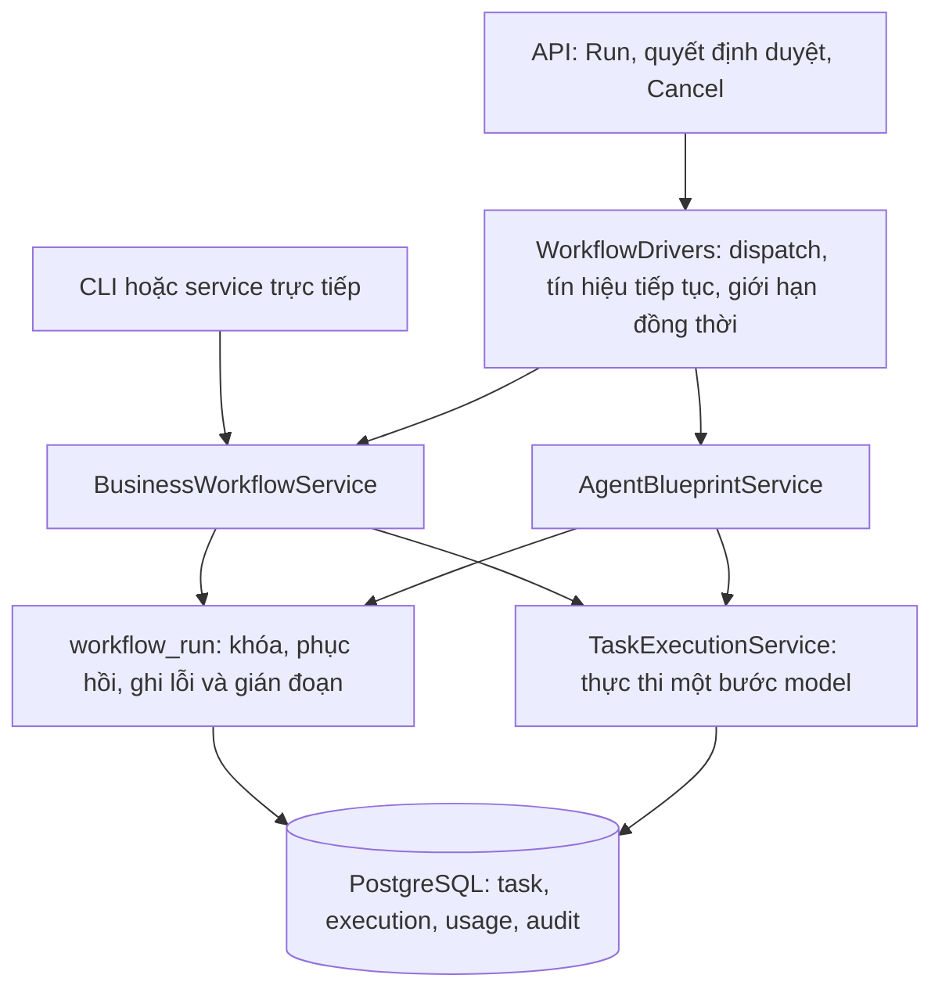

# Kế hoạch refactor O-Nexus — 2026-10-07

Ưu tiên đầu tiên là vòng đời của controller workflow. Một quy trình tuyển dụng
hoặc procurement phải giữ được bước đã hoàn thành, quyết định người duyệt và
chứng cứ khi API dừng. Việc chia file chỉ có ích nếu quyền sở hữu trạng thái rõ
hơn và lỗi có thể được tái hiện.

Đợt 1 triển khai phần vòng đời dùng chung; đợt 2 bên dưới triển khai transaction
và lease của đường chạy task chính. Không tối ưu tenant, đổi framework,
đổi schema hoặc chuyển các bản kế hoạch đã được duyệt sang template khác.
Các refactor tiếp theo được xếp theo rủi ro vận hành ở phần cuối.

## Vì sao bắt đầu từ controller

Trước thay đổi, `api/business_workflows.py` và `api/agent_blueprints.py` giữ hai
registry asyncio và hai cách khóa khác nhau. API của blueprint còn quyết định
trạng thái thất bại của cả cây khi driver bị ngắt. Tắt API bình thường có thể
biến công việc đang làm thành thất bại không thể tiếp tục trên cùng cây.

Business controller đã commit từng bước, nhưng bắt cả `CancelledError` như lỗi
nghiệp vụ. Cả hai đường cần một quy tắc chung để phân biệt lỗi, dừng theo yêu
cầu và gián đoạn hạ tầng. Lịch sử F190 trong `docs/FAILED_APPROACHES.md` cũng
cho thấy khóa hoặc lease chỉ có ích khi ranh giới transaction đúng.

## Các thiết kế đã so sánh

| Thiết kế | Luồng và chủ sở hữu | Đánh đổi |
| --- | --- | --- |
| Native với lifecycle dùng chung — được chọn | API → dispatcher của application → khóa PostgreSQL → controller → task, execution, audit | Giữ cách chạy CLI và console hiện có. Phục hồi từ checkpoint khi có lệnh Run tiếp theo. Chưa có hàng đợi bền vững hoặc tự tiếp tục sau restart |
| Temporal điều khiển toàn bộ cây | API → Temporal workflow → activity theo bước → approval signal | Có lịch sử replay và timer bền vững. Cần chuyển cả controller, worker, approval và cancellation. Console native phải có đường thực thi được xác định rõ khi Temporal tắt |
| Worker nhận lệnh từ bảng dispatch | API → lệnh lưu database → worker với lease, heartbeat và fencing token → controller | Có thể tiếp nhận lệnh bền vững mà không dùng Temporal. Thêm scheduler và schema mới bên cạnh scheduler đã có, tăng số trạng thái phải đối chiếu |

Thiết kế native xử lý lỗi hiện tại với phạm vi có thể nghiệm thu. Temporal vẫn
giữ vai trò hiện có cho task thường. Chưa thêm scheduler thứ hai hoặc LangGraph.
Khi nối hành động ghi dữ liệu thật, cần hoàn thành contract receipt rồi mới chọn
đường dispatch bền vững cho workflow nghiệp vụ.

## Quyền sở hữu sau refactor



`WorkflowDrivers` thuộc một instance ứng dụng. Registry chỉ giữ các driver trong
tiến trình đó. PostgreSQL giữ checkpoint và khóa chung cho cả API, CLI và lời gọi
service. Registry không được dùng để suy ra công việc đã hoàn thành.

`workflow_run` giữ advisory transaction lock trên một connection riêng. Commit
của bước không làm mất khóa. Rollback hoặc process chết giải phóng khóa, kể cả
khi connection thuộc pool. Controller giữ nguyên thứ tự bước và kiểm tra sản
phẩm, nguồn cùng hash của quyết định người duyệt.

## Những thay đổi đã triển khai

- Xóa driver, registry và logic ghi thất bại khỏi hai API. Run, quyết định duyệt,
  Cancel và shutdown dùng cùng dispatcher của application.
- Tách mail monitor khỏi API và dừng monitor trước khi dừng driver.
- Chuẩn hóa khóa giữa controller business và blueprint. Service trực tiếp cũng
  phải lấy khóa này.
- Gián đoạn giữ nguyên sản phẩm đã hoàn thành. Execution chưa xong được đóng
  với `controller_interrupted`, giữ token, chi phí, decision record và ModelUsage
  đã commit. Task không bị kết luận thất bại chỉ vì API tắt.
- Phục hồi execution bị bỏ lại sau kill trước khi tạo lần chạy mới. Bước chỉ tạo
  artifact, đọc mail, đọc chứng cứ hoặc viết file sandbox xác định được có thể
  chạy lại. Số attempt tăng cho lần thực thi mới.
- Bước gửi mail chưa rõ kết quả và loại hành động chưa biết giữ trạng thái chờ
  đối chiếu. Run lặp lại không bỏ khóa này hoặc giả tạo receipt.
- Giữ tín hiệu tiếp tục đến lúc driver còn đang thoát khỏi gate. Nhiều tín hiệu
  cùng lúc được gộp thành một lượt kiểm tra tiếp theo.
- Giới hạn mặc định bốn controller native hoạt động đồng thời. Cấu hình nằm tại
  `Settings.native_workflow_concurrency` và biến `AO_NATIVE_WORKFLOW_CONCURRENCY`.
  Mỗi controller giữ một connection khóa và có thể dùng thêm một connection cho
  bước. Khi điều chỉnh giới hạn, phải đo cả dung lượng pool và phần API cần dùng.
- Runtime, AgentContext và ModelUsage sử dụng execution ID thật. Trước đây runtime
  nhận ID tự sinh không có row tương ứng, làm việc lần theo log bị sai.

Root lưu thông tin phục hồi trong `constraints.workflow_lifecycle`. Report của
business và blueprint trả `lifecycle` và lý do gián đoạn. Trạng thái task vẫn là
nguồn chính cho tiến độ và trạng thái hoàn thành.

## Phạm vi đã chứng minh và giới hạn

Phép thử subprocess chạy controller procurement thật trên database test, commit
usage giả và checkpoint ở bước RFQ, rồi bị kill. Connection khác đọc được execution
đang chạy trước khi kill. Driver mới hoàn tất 13 bước, giữ các artifact đã xong,
không tạo execution thứ hai cho các bước đó và giữ usage của lần bị ngắt.

Phép thử shutdown kiểm tra business và blueprint. Blueprint tiếp tục đến một
gate người duyệt thật, không tự duyệt và không tạo yêu cầu duyệt trùng. Phép thử
mail không gọi mailbox khi hành động cũ chưa được đối chiếu. Phép thử dispatcher
kiểm tra tín hiệu đến muộn, giới hạn đồng thời và hai ứng dụng có registry riêng.

Các test dùng nội dung giả, PostgreSQL và controller thật. Không gửi mail thật
hoặc gọi model trả phí. Đây là bằng chứng về vòng đời, không chứng nhận chất lượng
tuyển dụng hoặc chất lượng model.

Sau restart cần có lệnh Run hoặc tín hiệu tiếp tục mới để phục hồi. Lệnh đang
đợi trong dispatcher chỉ nằm trong bộ nhớ. Một request đã được nhận chưa đồng
nghĩa với dispatch đã được ghi bền vững. Cũng chưa có nút đối chiếu receipt cho
mail gửi chưa rõ kết quả. Hành động đó bị khóa cho đến khi cơ chế đối chiếu được
nghiệm thu, hoặc bị hủy theo yêu cầu.

Cancellation hiện ngắt ngay driver ở cùng tiến trình API. Với nhiều API process,
root stop được ghi trong database nhưng worker khác chỉ quan sát ở checkpoint.
Chưa chứng minh dừng tức thời lời gọi bên ngoài ở mọi process. General task lease
trong F190 chưa được sửa bởi refactor controller này.

## Đợt 2 — transaction và lease của executor, 2026-10-07

Đã đưa pipeline native/local runner, cả hai đường Temporal activity/factory và
entrypoint `make demo`/`make run-fleet` qua `application/task_attempt.py`.
`TaskAttemptRunner` sở hữu session có thể commit; `TaskExecutionService` vẫn là
đường thực thi nghiệp vụ một task. Controller business/blueprint giữ lifecycle
riêng đã nghiệm thu ở đợt 1. Những script chẩn đoán cũ gọi service trực tiếp vẫn
là caller transaction-scoped; không được coi chúng là đường có heartbeat mới.
Guard của service từ chối execution đang hoạt động đã được commit, kể cả khi
caller cũ không đi qua runner.

- Advisory transaction lock riêng cho từng task, không giữ khóa dòng task qua
  lời gọi model. Claim và execution thật, context/skill snapshot và audit được
  commit trước runtime. Usage và tool records nội bộ được checkpoint trước lượt
  model tiếp theo. Checkpoint áp lại tenant binding sau commit.
- Heartbeat dùng session riêng, chỉ gia hạn khi task và đúng execution ID còn
  running. Mặc định lease 120 giây, heartbeat 5 giây; cấu hình duy nhất tại
  Settings qua `AO_TASK_EXECUTION_LEASE_S` và `AO_TASK_EXECUTION_HEARTBEAT_S`.
  Chu kỳ được chặn không vượt một phần ba lease. Temporal nhận heartbeat cùng
  ID task/execution; lỗi heartbeat dừng runtime và được báo, không nuốt.
- Cancel từ connection/process khác không chờ khóa của model. Poll heartbeat
  quan sát quyết định; checkpoint kiểm tra lại trước ghi sản phẩm. Finalization
  giữ khóa dòng ngắn đến commit để quyết định hủy không bị ghi đè bởi kết quả
  model về muộn. Không hứa dừng tức thời tác động bên ngoài đã gửi đi.
- Tắt hoặc hủy coroutine giữ usage đã commit, đóng execution và đưa general task
  chưa xong sang blocked/chờ đối chiếu. Task đã canceled giữ nguyên canceled.
  Kill cứng để lại claim/lease/execution nhìn thấy từ connection khác, giải phóng
  advisory lock nhưng không tự replay hành động chưa có receipt. General task
  cần xử lý attempt bị bỏ lại trước retry; workflow business/blueprint vẫn có
  cơ chế phục hồi theo từng loại bước đã được nghiệm thu ở đợt 1.
- Claim hiện rõ cũng làm lộ race trong settlement: coordinator running chưa có
  child không đồng nghĩa model đã kết thúc. `settle_finished` bỏ qua task có
  execution còn running để không đánh dấu thất bại hoặc hoàn tất sớm.

Phép thử đọc PostgreSQL từ session thứ hai khi runtime còn chờ, quan sát lease
được gia hạn, cập nhật dòng và Cancel trong tối đa một giây, chạy hai runner,
caller cũ, factory Temporal, lỗi heartbeat và subprocess bị kill. Nội dung/model
đều là fixture, không dùng kết quả này làm chứng nhận chất lượng model thật.
Lỗi commit claim cũng được kiểm tra: giữ lỗi gốc, không gọi runtime và không
ghi audit với execution đã rollback. Gate phát hành và số phép thử cuối được
ghi trong WORK_REPORT.md.

Đây chưa phải contract receipt cho external write, dispatch bền vững hay migration
mọi script lịch sử. Một connection khóa và session runtime/pulse làm tăng nhu cầu
pool; cần đo pool wait và p95 dưới tải trước tăng concurrency. Context đọc và
connector chuyên biệt vẫn cần được rà theo contract ở đợt 3. Không mở quyền mới,
không sửa dữ liệu của campaign đã được duyệt.

## Thứ tự refactor tiếp theo

| Thứ tự | Phạm vi | Vấn đề phải giải quyết | Điều kiện nghiệm thu |
| --- | --- | --- | --- |
| 2 — đã triển khai đường chạy chính | Transaction và attempt của `TaskExecutionService`, `local_runner`, worker runtime, Temporal activity | General lease có thể chưa nhìn thấy từ connection khác. Service còn trộn context, quyền, delegation, output, learning và persistence | Claim và heartbeat nhìn thấy trong khi model còn chạy. Kill và reaper không nhận nhầm worker sống. Không giữ transaction ghi qua network chậm. Cancellation không đợi khóa của model |
| 3 | Contract và receipt của connector | SMTP, IMAP và các app tương lai có kết quả bên ngoài database. Retry theo task ID chưa chứng minh write không bị lặp | Action key ổn định, snapshot đầu vào, receipt, read-back, cursor, timeout và lỗi có kiểu. Test kill trước và sau external write. Có màn hình đối chiếu kết quả chưa rõ |
| 4 | Dispatch bền vững cho business workflow | Lệnh native chờ chạy có thể mất khi process chết. Tín hiệu ở process khác chưa có đường bàn giao bền vững | Chọn một chủ sở hữu dispatch. Request ack gắn với lệnh đã lưu. Approval và Cancel không mất khi nhiều worker chạy. Worker restart tiếp tục đúng checkpoint với receipt đã đối chiếu |
| 5 | Template HR theo campaign | Một blueprint HR hiện có thể gom tuyển dụng, payroll, performance và offboarding vào một lượt | Template riêng, required inputs theo bước, source SOP rõ. Campaign giữ snapshot đã duyệt. Bản cũ và quyết định đã ghi không bị sửa ngầm. MEP tuyển dụng được nghiệm thu trước |
| 6 | Tách trách nhiệm trong service thực thi và kiểm tra sản phẩm | `task_execution.py` còn khoảng 2.862 dòng. `_finish`, context, capability, consultation và delegation khó đọc độc lập | Acceptance và quyết định trạng thái thành hàm domain thuần. Adapter I/O có contract rõ. Giữ một owner của transaction và attempt. Negative cases cũ vẫn kiểm tra cùng lỗi |
| 7 | State và projection của console | Frontend đã có source module và `page.py` lắp ghép. Work còn giữ state chung cần tách có chủ đích | Một state owner theo route, hủy polling khi rời trang, stale response không ghi đè. Deep link mở đúng task, stage, execution hoặc approval. UI hiển thị gián đoạn, nguồn và hành động phục hồi cụ thể |
| 8 | Chẩn đoán và đo tải | Có telemetry nhưng cần chứng cứ theo toàn workflow và workload thật | Theo được root → stage → attempt → model hoặc connector receipt. Đo p50, p95, pool wait, lock wait, thời gian gate và lỗi theo category. Load test song song với API đọc log và phê duyệt |

Thứ tự 2 và 6 cùng tác động service thực thi nhưng mục đích khác nhau. Ranh giới
transaction phải được sửa và chứng minh trước khi chia các trách nhiệm còn lại
thành module. Không chia file theo số dòng rồi giữ nguyên state ngầm.

Tối ưu relay hoặc tenant không thuộc kế hoạch triển khai hiện tại. Chất lượng
model, corpus chuyên gia và học từ phản hồi vẫn theo [FUTURE_WORK.md](FUTURE_WORK.md).
Refactor không tự mở quyền tự chủ hoặc biến kết quả mock thành bằng chứng thật.

## Kiểm tra và triển khai

Các phép thử phục hồi có thể chạy lại bằng:

```sh
uv run pytest tests/unit/test_workflow_drivers.py tests/unit/test_workflow_lifecycle.py tests/integration/test_workflow_recovery.py tests/integration/test_agent_blueprints.py tests/integration/test_business_workflow.py -q
```

PostgreSQL dùng port 55432 và schema `ai_orchestrator_test`. Áp migration và seed
catalogue test theo AGENTS.md trước khi chạy. Subprocess fixture từ chối database
development. Gate phát hành là `make lint`, `make typecheck`, `make test`,
`make test-e2e` và `make page`. Kết quả gate của đợt này nằm trong WORK_REPORT.md.

Không có schema migration. Rollback source dùng Git revert. Trước khi thay phiên
bản controller, dừng dispatch mới và chờ hoặc tạm dừng driver đang chạy. Phiên bản
cũ có thể đánh dấu bước đang phục hồi là lỗi, nên không chạy hai phiên bản controller
khác quy tắc đồng thời trên cùng root.
