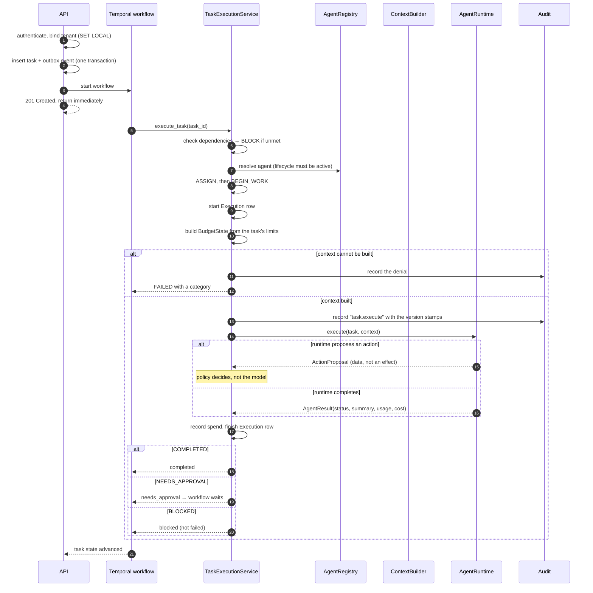
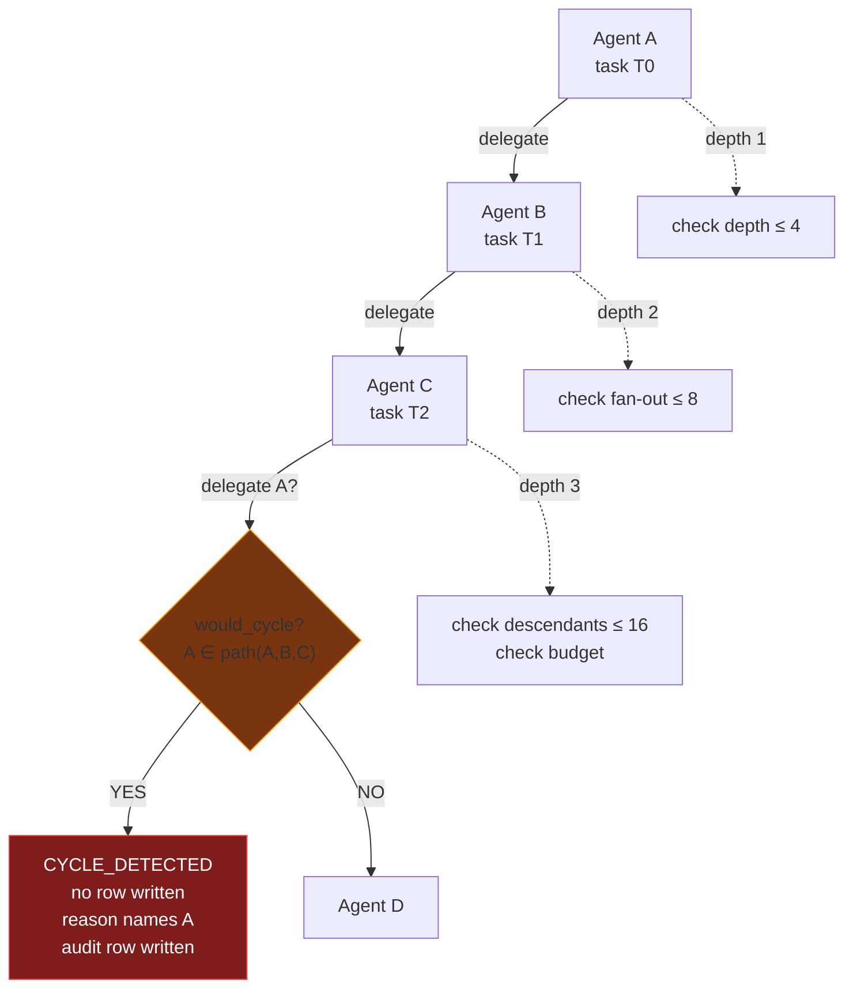
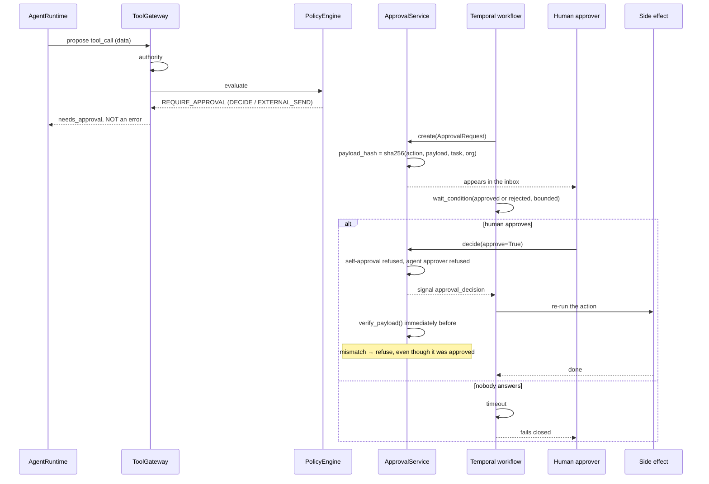
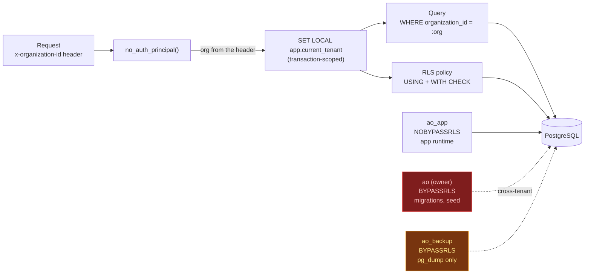
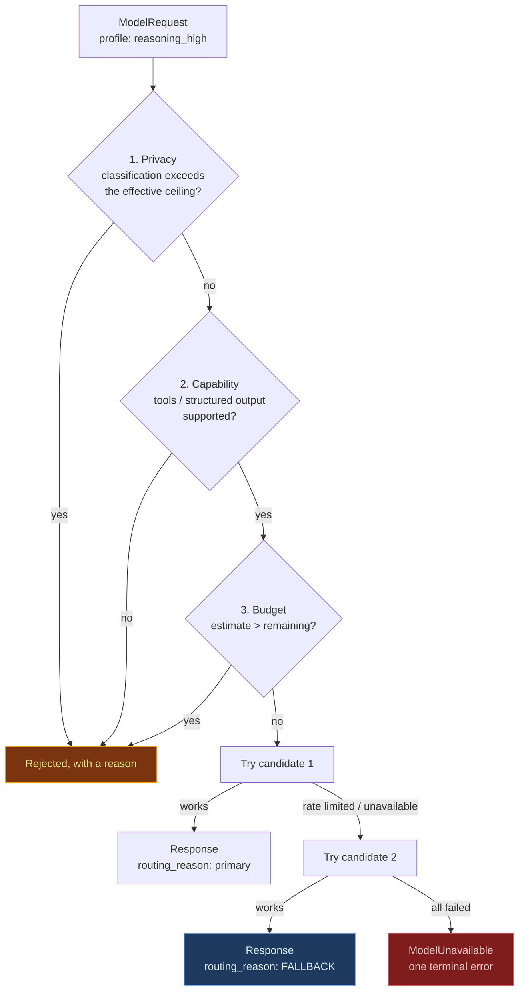

# Architecture

## 1. The shape

A control plane and an agent runtime, separated by a seam that is a `Protocol`
rather than a base class.

```mermaid
graph TB
    subgraph client ["Client"]
        UI["Operator UI<br/>2,904 lines, one file, no bundler"]
        CLI["ao CLI"]
    end

    subgraph cp ["Control Plane"]
        API["FastAPI<br/>95 operations"]
        AUTH["No auth<br/>simulated personas + role switcher"]
        APP["Application services<br/>task execution"]
    end

    subgraph domain ["Domain (pure, no I/O)"]
        SM["State machines"]
        AUTHZ["Authority + policy"]
        DEL["Delegation graph"]
        BUD["Budget"]
        CONTRACTS["Execution contracts"]
    end

    subgraph rt ["Agent Runtime"]
        PAI["PydanticAI adapter"]
        SCR["Scripted runtime"]
        NUL["Null runtime"]
    end

    subgraph gw ["Gateways"]
        TG["Tool gateway"]
        MG["Model gateway"]
        AG["A2A gateway<br/>EXTERNAL_SEND"]
    end

    subgraph infra ["Infrastructure"]
        PG[("PostgreSQL 16<br/>RLS + pgvector")]
        NATS["NATS JetStream"]
        TEMP["Temporal"]
        MCP["MCP servers<br/>(untrusted)"]
        LLM["Model providers"]
    end

    CLI --> API
    UI -.-> API
    API --> AUTH
    API --> APP
    APP --> domain
    APP --> RT
    APP --> TG
    APP --> MG
    APP --> AG
    TG --> MCP
    MG --> LLM
    AG --> PEER["remote agent<br/>another process"]
    APP --> PG
    APP --> NATS
    APP --> TEMP
    RT -.->|"Protocol, not base class"| CONTRACTS

    style domain fill:#1a3a2a,stroke:#4ade80
    style rt fill:#2a2a3a,stroke:#818cf8
    style infra fill:#3a2a1a,stroke:#fbbf24
```



The green box is the point. It imports nothing that can open a socket, and
`tests/unit/test_domain_purity.py` asserts that by parsing the AST of every
module in it. If the rules that stop an agent from doing something harmful are
the hardest to test, they will be the least tested.

## 2. Layers and the direction of dependency

```
api  ──────────►  application  ──────────►  domain
                        │                        ▲
                        ▼                        │
                  infrastructure ───────────────┘
```

`domain` imports nothing from the package. Everything else may import it.
`tests/unit/test_domain_purity.py` enforces both halves: no I/O module, and no
import of a sibling layer.

## 3. Task execution

The order is the design. Each step can stop the task, and the three ways of
stopping are different on purpose — conflating them is what makes "blocked" and
"denied" indistinguishable to an operator.



Note what is absent: the runtime never performs a side effect, never reads
memory outside its scope, and never exceeds its budget. It is handed a
pre-authorised context and it *proposes*. That is why the adapter is small, and
why swapping frameworks would not swap governance.

## 4. Delegation and cycle detection

The single most important diagram in the system, because the failure it prevents
is a fork bomb with a language model attached.



Four checks run in a fixed order, and the order is a decision:

1. **self-delegation** — before the cycle test, so the denial says what actually
   happened rather than reporting a one-hop "cycle";
2. **cycle** — before the numeric checks, because unbounded self-replication is
   the worst consequence;
3. **depth / fan-out / descendants**;
4. **budget narrowing** — a child's envelope can only ever be *narrower* than its
   parent's.

The full `DelegationPath` is persisted with the delegation. That is what makes
the check auditable afterwards: the row shows the route that was evaluated, not
just the refusal.

Depth alone is not sufficient. `A → B → C → A` stays at depth 3, well under the
limit of 4, and loops forever because the walk resets when the task is re-queued.
Only the ancestor-path check stops it.

## 5. Events: outbox, relay, consumer

```mermaid
sequenceDiagram
    participant SVC as TaskRepository
    participant PG as PostgreSQL
    participant RELAY as OutboxRelay
    participant NATS as NATS JetStream
    participant CONS as DurableConsumer
    participant DD as dedup table

    rect rgb(26,58,42)
    Note over SVC,PG: one transaction
    SVC->>PG: INSERT/UPDATE task
    SVC->>PG: INSERT events
    SVC->>PG: INSERT outbox_events (published_at NULL)
    end

    Note over RELAY,PG: organizations is the one table without RLS,<br/>so the relay enumerates tenants from it
    RELAY->>PG: SELECT id FROM organizations
    loop one tenant at a time, rotating cursor
        RELAY->>PG: SET LOCAL app.current_tenant = org
        RELAY->>PG: SELECT ... FOR UPDATE SKIP LOCKED
        RELAY->>NATS: publish CloudEvent
        RELAY->>PG: UPDATE published_at
    end

    NATS-->>CONS: deliver (at-least-once, by design)
    CONS->>DD: seen(event_id, org_from_envelope)?
    alt already processed
        CONS->>NATS: ack, no side effect
    else new
        CONS->>CONS: apply the effect
        CONS->>DD: record(event_id, org)
        CONS->>NATS: ack
    end

    alt handler fails, deliveries < max
        CONS->>NATS: nak(delay=5s)
    else handler fails, or non-retryable
        CONS->>NATS: publish to ao.deadletter, then term
    end
```



Four properties this shape gives, and why each matters:

- **The event and the state change commit together.** Publishing inside the
  transaction would hold a row lock across a network call and emit events for
  transactions that roll back.
- **The relay is tenant-scoped, not cross-tenant.** It enumerates tenants from
  `organizations` — the one table deliberately without RLS, because it is the
  tenant root — and then works inside one tenant at a time. A single unbound
  session would match **zero** rows, because the policy compares
  `organization_id` to an unset GUC; that is the isolation working, and it looks
  exactly like an empty queue. The alternative, a third `BYPASSRLS` role, would
  work and would also create a third role that reads every tenant's rows — the
  capability this platform refuses to create. A property falls out for free: one
  tenant with a permanent backlog cannot starve the others.
- **`SKIP LOCKED` makes relays disjoint.** Several relay instances can run
  against one table without coordinating, and none of them republishes another's
  rows.
- **Dedup is in PostgreSQL, not memory.** In-memory dedup is lost on restart, and
  a consumer that restarts with an empty set re-applies everything it already
  handled. A restart during an incident is exactly when that matters most. The
  tenant comes from the *event envelope*, because a consumer serving every tenant
  from one process has no ambient tenant to read.

A message that fails repeatedly is moved to `ao.deadletter` with its reason
rather than retried forever. A queue that spins on one poisoned row is a queue
that has stopped.

## 6. Approval: the pause



The `verify_payload` call immediately before the side effect is the part that
is easy to omit and expensive to lack. Anything that could change the payload
between the human reading it and the system acting on it — a summarising model, a
template expansion, a re-read of external data — is caught there and nowhere
else.

An unanswered approval is a decision. The default is to fail closed.

## 7. Multi-tenancy

Authentication is out of scope by decision: there is no login, no token, no RBAC,
and the operator is a simulated persona with a role switcher. Tenancy is **not**
out of scope, and that is the line worth drawing. Turning off authentication must
not turn off isolation -- with no tenant on the request every query runs unbound,
row-level security returns nothing, and an empty platform is indistinguishable
from a broken one. So `x-organization-id` is still required, and a request without
it is refused with a sentence saying why.



`SET LOCAL`, not `SET`. A pooled connection retains `SET` across transactions, so
`SET` would let one tenant's identity leak into the next request — a failure that
works perfectly in a test and leaks only under concurrency.

Two consequences worth naming:

- **The application connecting as the owner would make every RLS policy inert
  while the policies still sit in the schema looking correct.** So
  `assert_app_role_is_least_privilege()` runs at startup and again in `/ready`.
- **A cross-tenant `UPDATE` succeeds with `rowcount = 0` rather than raising.**
  RLS filters the row out of the scan, so the statement matches nothing and
  returns success. Code that checks "did the UPDATE raise?" instead of "did it
  affect a row?" will believe a cross-tenant write succeeded. The test asserts
  on the data, not on the absence of an exception.

## 8. Model routing



Privacy is a **filter**, not a preference: a restricted document must never reach
a provider the policy has not approved, whatever it costs or how fast it is. The
effective ceiling is the strictest of the profile's and the provider's, so
neither can be widened by editing the other.

A fallback is recorded *as a fallback*. An evaluation that counts a
fallback-served run as a primary pass flatters itself, and a cost report that
does the same under-reports the price of resilience.

## 9. The runtime seam

```mermaid
graph LR
    P["TaskExecutionService"]
    P --> AR["AgentRuntime<br/>Protocol"]
    AR --> S1["ScriptedRuntime<br/>deterministic, offline"]
    AR --> S2["NullRuntime<br/>typed failure, no attempt"]
    AR --> S3["PydanticAIRuntime<br/>primary"]
    S3 --> PAI["pydantic_ai bridge<br/>implements pydantic_ai Model"]
    PAI --> GW["our ModelGateway<br/>privacy · capability · budget · fallback"]
    AR -.-> S4["any third-party runtime<br/>satisfies the Protocol"]

    style PAI fill:#1e3a5f,stroke:#60a5fa,color:#dbeafe
    style GW fill:#1a3a2a,stroke:#4ade80
    style AR fill:#1a3a2a,stroke:#4ade80
```



The Protocol takes an `AgentTask` and an `AgentContext` and returns an
`AgentResult`. The contracts in `domain/contracts.py` import nothing
framework-specific, and `tests/unit/test_runtime_swap.py` asserts that swapping
the runtime changes nothing in the organisation, task, policy, authorisation,
memory or event contracts.

The bridge is the important part of that diagram. PydanticAI provides the
*agent loop*; the *model* underneath it is our `ModelGateway`, reached through a
`pydantic_ai.models.Model` implementation. Handing PydanticAI its own provider
would be a second control plane — a path where a restricted document could reach
a provider the policy has not approved, and where the cost never reached
`model_usage`. That is the specific failure the gateway exists to prevent, so the
gateway is the model.

`AgentRuntime.execute` also takes an optional `record_usage` callback, so the
per-call ledger learns which provider served which profile and whether it was a
fallback. A runtime is the thing that knows what it called, so that belongs in
the contract rather than in a private hook.

## 10. Component inventory

| Package | Responsibility | Depends on |
|---|---|---|
| `domain/` | Pure rules: ids, enums, state machines, authority, policy, delegation, budget, contracts, errors | nothing in the package |
| `application/` | Use cases that order the domain's rules | domain, persistence |
| `persistence/` | Schema, tenant-bound sessions, RLS, repositories | domain |
| `agent_runtime/` | Runtime adapters and context assembly | domain |
| `models/` | Provider routing, privacy, budget, cost | domain |
| `tools/` | Registry, argument validation, the gateway | domain, policy |
| `mcp/` | Untrusted external tool servers | tools, domain |
| `memory/` | Tiers, chunking, scoped retrieval | domain, persistence |
| `approvals/` | The pause point | domain, persistence |
| `audit/` | Append-only record | domain, persistence |
| `events/` | CloudEvents, NATS, outbox relay, consumers | domain, persistence |
| `workflows/` | Temporal workflows and client | application |
| `api/` | 95 operations, middleware, error shape | application, persistence |
| `security/` | Tenancy, the no-auth principal, rate limiting | domain, config |
| `telemetry/` | Logging with redaction, tracing, metric names | config |
| `config/` | Every setting, resolved once | nothing |

## 11. Decisions that shaped the shape

| Decision | Alternative | Why |
|---|---|---|
| Tenant predicate in the query, not after ranking | Filter after retrieval | An approximate index can return a cross-tenant neighbour; the test uses two identical corpora to prove it |
| `SET LOCAL` for the tenant GUC | `SET` | `SET` survives on a pooled connection |
| App connects as `NOBYPASSRLS` | Share the owner role | The owner bypasses every policy, silently |
| Transactional outbox | Publish inside the transaction | Holds a row lock across a network call; emits events for rolled-back work |
| `text[]` for capability lists | `JSONB` | `jsonb` has no array overlap operator and no useful GIN index |
| Money as `NUMERIC(18,6)` | `float`, or cents | A `$0.0004` call rounded to `$0.00` reports free work as free |
| ULID primary keys | Sequences | Sorts by creation, mintable offline, and leaks no row count |
| Protocol seam, not a base class | Inherit from a framework | A third-party runtime becomes valid with no registration step |
| Linear Alembic history | Hand-ranked migrations | A new migration that forgets a number runs in the wrong order |
| Native dev stack | Docker Compose | No runtime on this machine; an unrun compose file is a fake production path |
