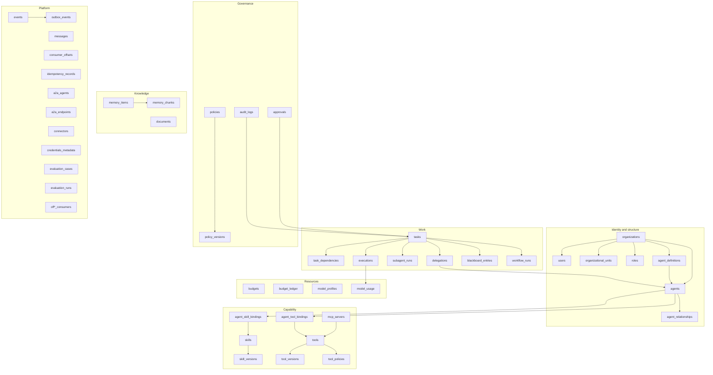

# Data Model

The schema is **104 tables** across **29 linear migrations**, 101 of them with
row-level security enabled and forced. Every revision is verified by running
`alembic upgrade head` against a real cluster and querying the result, and
`tests/integration/test_schema_matches_models.py` runs Alembic's
`compare_metadata` so the ORM cannot drift from the schema.

The tables documented below are the tenant-scoped core — 27 of the 104. The
construction, procurement, document-control and governance tables added by
`0007` onward follow the same five rules; their names are in the migrations
themselves.

## 1. Conventions

Five rules, applied everywhere, stated once:

**`organization_id NOT NULL` on every tenant-scoped table**, and it leads every
composite index. Tenant isolation is then a property of the schema rather than
something a query author must remember. The four tables without it are named
explicitly in `persistence/rls.py::GLOBAL_TABLES`.

**Text primary keys holding a prefixed ULID.** `agt_01m3d2...`. A sequence would
leak row counts and require a round trip to mint an id; a sortable ULID gives
k-sortable natural keys for free and lets any component mint an id offline.
Monotonicity is not free — a naive implementation re-randomises within the same
millisecond and the ids do not order, which `test_ulid_is_monotonic_and_prefixed`
caught.

**`NUMERIC(18,6)` for money, `TIMESTAMPTZ` for time.** Never float, never naive.
Six decimal places, not two: a call costing `$0.0004` rounded to cents reports
free work as free.

**`JSONB` with an explicit schema version.** JSONB is where schema drift hides,
so the envelope carries `schema_version` and the type string is the contract.

**Server defaults on every optional column.** Not just Python defaults. The
Python default applies to the ORM; a raw `INSERT` — which is how the API, the
seed script and `psql` all write — would hit a NOT NULL violation instead of an
empty value.

## 2. Entity groups



## 3. Inventory

| Group | Tables | Notes |
|---|---|---|
| Identity and structure | 7 | `organizations`, `users`, `organizational_units`, `roles`, `agent_definitions`, `agents`, `agent_relationships` |
| Capability | 9 | `skills`, `skill_versions`, `tools`, `tool_versions`, `mcp_servers`, `tool_policies`, `agent_skill_bindings`, `agent_tool_bindings`, `model_profiles` |
| Work | 7 | `tasks`, `task_dependencies`, `delegations`, `subagent_runs`, `executions`, `blackboard_entries`, `workflow_runs` |
| Governance | 4 | `policies`, `policy_versions`, `approvals`, `audit_logs` |
| Resources | 3 | `budgets`, `budget_ledger`, `model_usage` |
| Knowledge | 3 | `memory_items`, `memory_chunks`, `documents` |
| Platform | 8 | `events`, `outbox_events`, `messages`, `consumer_offsets`, `idempotency_records`, `a2a_agents`, `a2a_endpoints`, `connectors` |
| Evaluation and credentials | 3 | `evaluation_cases`, `evaluation_runs`, `credentials_metadata` |

**657 columns, 54 indexes.**

## 4. The six constraints that carry the design

Everything else in the schema is bookkeeping. These six are the design.

### 4.1 One live copy of a piece of work

```sql
CREATE UNIQUE INDEX uq_tasks_active_dedup_key
  ON tasks (organization_id, dedup_key)
  WHERE status NOT IN ('completed','failed','canceled','expired');
```

Two columns, not one. `fingerprint` is the **intent** hash and never changes;
`dedup_key` is what the index applies to, salted when the caller explicitly asked
for parallel work.

The naive single-column version cannot express both requirements: it must either
block deliberate parallelism, or relax the index and lose the guarantee. Keeping
them separate means "did these two agents ask for the same thing?" stays
answerable by querying `fingerprint` alone, which is a question an operator
actually asks.

*Proved by*: `test_equivalent_goal_is_rejected`, `test_parallel_work_must_be_requested_explicitly`.

### 4.2 Tenant isolation in the database

42 tables, one policy:

```sql
ALTER TABLE "tasks" ENABLE ROW LEVEL SECURITY;
ALTER TABLE "tasks" FORCE ROW LEVEL SECURITY;
CREATE POLICY tenant_isolation ON "tasks"
  USING      (organization_id = current_setting('app.current_tenant', true))
  WITH CHECK (organization_id = current_setting('app.current_tenant', true));
```

`FORCE` is load-bearing: without it the table owner bypasses every policy, and the
owner is the role migrations run as.

An unset GUC yields `''`, which matches no `organization_id` — so an unbound
session sees nothing. The tempting alternative,
`... OR current_setting(...) = ''`, silently disables isolation for every code
path that forgot to bind a tenant.

`WITH CHECK` is the half usually omitted, and the half that matters: `USING`
filters reads, `WITH CHECK` stops a cross-tenant *write*.

*Proved by*: 12 tests in `tests/integration/test_tenant_isolation.py`.

### 4.3 The audit ledger is append-only

```sql
REVOKE UPDATE, DELETE ON audit_logs FROM ao_app;
GRANT   SELECT, INSERT ON audit_logs TO ao_app;
```

Not by convention in the application. A compromised agent can record what it did
and cannot erase it. The grants are asserted against the catalogue, because a test
connected as the owner would pass trivially.

`audit_logs.id` is a ULID and `audit_logs.sequence` is a separate monotonic
integer, because two entries in the same millisecond must still have a defined
order and a wall clock does not provide one.

### 4.4 The application cannot bypass RLS

```sql
CREATE ROLE ao_app LOGIN NOSUPERUSER NOCREATEDB NOCREATEROLE NOBYPASSRLS NOINHERIT;
CREATE ROLE ao_backup LOGIN ... BYPASSRLS NOINHERIT;  -- pg_dump only
```

The split is the whole tenant-isolation story. An application connected as the
owner would run every query with isolation switched off while the policies still
sat in the schema looking correct. `assert_app_role_is_least_privilege()` runs at
startup and in `/ready`, and the settings layer refuses the two configurations
that would defeat it.

`ao_backup` exists because `pg_dump` cannot read rows that `FORCE ROW LEVEL
SECURITY` hides. Without it, a backup of this platform would contain zero rows
for every tenant and look healthy.

*Proved by*: `test_application_role_cannot_bypass_rls`, `test_application_role_cannot_delete_audit_rows`.

### 4.5 One current version per policy

```sql
CREATE UNIQUE INDEX uq_policy_versions_current
  ON policy_versions (organization_id, policy_id) WHERE is_current;
```

"Two current versions" is impossible at the database level rather than by
convention. A correction is a new row; a rollback is a flag on a prior row.

### 4.6 Append-only ledger with reversing entries

`budget_ledger` is append-only. A correction is a row that reverses a prior one
(`reverses_entry_id`), never an update — otherwise the audit trail cannot explain
how the organisation arrived at its current spend.

## 5. Type choices that were corrected

| Column | Was | Now | Why |
|---|---|---|---|
| `agents.capabilities` | `JSONB` | `text[]` + GIN | `jsonb` has no array overlap operator: `&&` and `?|` both fail, and there is no useful GIN index. Capability search would degrade to loading every row. `FAILED_APPROACHES.md` F6. |
| `approvals.required_approver_roles` | `JSONB` | `text[]` | Identical latent problem: the inbox query needed array containment. |
| `memory_chunks.embedding` | — | `Vector(512)` + `embedding_model` | The model is part of the chunk's identity. Mixing vectors from two models in one index returns nonsense with high confidence. |
| `audit_logs.sequence` | autoincrement PK | separate `BIGINT` | Identity and ordering are different concerns; the PK must be referenceable from an approval. |
| every `NUMERIC` | cents (2 dp) | 6 dp | A `$0.0004` call must not report as `$0.00`. |

## 6. Foreign keys that earned their keep

Four tests failed against real constraints before the tests were fixed. That is
the point of having them, and it is worth recording which constraint caught what:

| Constraint | Caught |
|---|---|
| `agents.definition_id → agent_definitions` | A test creating an agent with a fabricated definition id. An agent without a definition has no instructions and nothing to reproduce. |
| `approvals.decided_by → users` | A test approving as `usr_admin`, which did not exist. A decision must be attributable to a principal that exists; an audit row pointing at a name that never was is not an audit row. |
| `memory_items.agent_id → agents` | A test scoping memory to `agt_a`. An orphan scope is invisible and un-auditable. |
| `tasks.parent_task_id → tasks` | Forced the self-referential cycle check to be a graph walk at insert time rather than a discovery at run time. |

One reference is deliberately *not* a foreign key: `delegations.approval_id`. The
chain `approvals → executions → delegations → approvals` is a genuine cycle, and
forcing topological DDL order on it would mean either deferred constraints
throughout or breaking a real relationship. `approvals.approval_id` being the
deciding column is enough to join on. A schema that cannot be created is not a
schema.

## 7. Indexes

54, and most exist for a stated reason rather than by reflex.

| Index | Serves |
|---|---|
| `uq_tasks_active_dedup_key` | The deduplication guarantee |
| `ix_agents_capabilities_gin` | Capability discovery as an index scan |
| `ix_agents_discovery` | `(org, lifecycle, runtime)` — the common discovery predicate |
| `ix_tasks_org_owner` | `(org, owner, status)` — "what has this agent got" |
| `ix_tasks_org_status` | Task list and status counts |
| `ix_memory_chunks_vector` | HNSW over the embedding, `vector_cosine_ops` |
| `ix_memory_chunks_org_model` | Partition by embedding model, so vectors are never mixed |
| `ix_memory_items_expiry` | Partial, on `retention_until IS NOT NULL` — the retention sweep |
| `ix_outbox_unpublished` | The relay's claim query, `(published_at, created_at)` |
| `ix_approvals_org_status` | The operator's inbox |
| `ix_delegations_{source,target}` | Fan-out and active-descendant counts |
| `ix_audit_{org_time,resource,task,actor}` | The four audit query shapes |
| `uq_policy_versions_current` | One current version |
| `ix_org_units` on `(org, parent)` | Tree traversal |
| `ix_events_org_{type,subject}` | Event replay by type and by entity |
| `ix_evaluation_runs_adapter` | Benchmark comparison across runtimes |

## 8. Migrations

| Revision | What |
|---|---|
| `e16621b0d3d9` | The 44 tenant-scoped core tables, autogenerated from the models |
| `0002` | RLS, `ao_app`, `ao_backup`, grants, `ALTER DEFAULT PRIVILEGES` |
| `0003` | `model_profiles.max_classification` |
| `0004`–`0006` | Procedure fingerprint, quarantine, schema-drift repair |
| `0007`–`0011` | Construction, commercial front end, contracts and claims, the process spine, the material master |
| `0012`–`0020` | Requisition to receipt, constraint-name truncation fix, progress snapshots and readings, agent framework and procedure versions |
| `0021`–`0024` | Tenant foreign keys for orchestration, governance and construction; extraction confidence |
| `0025`–`0029` | Document control, delegation intent, requester agent, skill derivation, execution call counts |

Three decisions:

**Autogenerated, not hand-written.** The models are the single source of truth,
and `compare_type=True, compare_server_default=True` means the comparison sees
what the application sees — without it, a rename looks like a drop-and-add and a
changed default is invisible.

**Linear history, never hand-ranked.** The legacy project's
`db/migrate.js:16` ranks 43 files with a one-line ternary; a new migration that
forgets its number runs in the wrong order and either fails confusingly or
succeeds into a wrong state. Here `down_revision` is a chain.

**A column default is a literal, not SQL.** `0003` shipped
`server_default="'restricted'"` and stored the eleven-character string
`'restricted'`, quotes included: in `op.add_column` the string is a SQL
expression, so the quotes became part of the value. The fix is a bare
`server_default="restricted"`, which SQLAlchemy quotes. It was visible only
because the endpoint that reads the column was checked against a live API rather
than against the migration log.

## 9. Operational notes

**Backups** use `ao_backup`, because `pg_dump` as `ao_app` returns nothing under
`FORCE ROW LEVEL SECURITY`.

**Retention** is enforced, not promised: `MemoryService.purge_expired` is
callable and is called by the operations task. Retention without enforcement is a
promise nobody keeps.

**Row counts for the health dashboard** come from `scripts/audit_db.py`, which
also reports RLS coverage and any table that lost its policy — because a table
created without a policy otherwise looks identical to a protected one.

**Migrations run as the owner; the application never does.** `Settings` keeps the
two DSNs as separate properties so a request handler reaching for the owner DSN
is a visible mistake.
