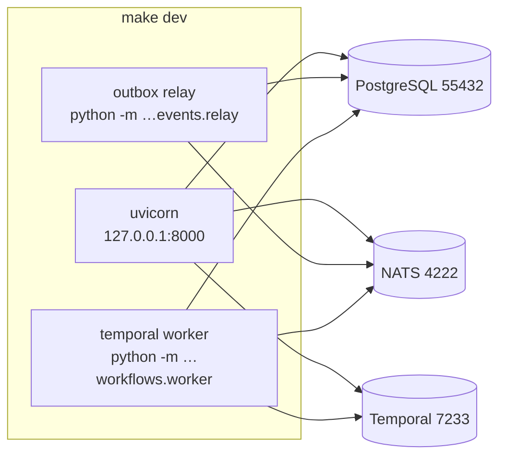

# Deployment

## The deviation, stated up front

The brief asked for Docker Compose and Kubernetes manifests. **Neither is
here.** There is no container runtime on the build machine:

```console
$ which docker podman kubectl nerdctl
(nothing)
```

A compose file could have been written. It could not have been run, and the
brief's own definition of done — "no fake production paths in the real code
path" — makes an unrun compose file a violation rather than a partial delivery. A
manifest that has never been applied is indistinguishable from a wrong one, and
the reader has no way to tell which they are looking at.

So: the native process stack below is the **only** documented deployment path,
because it is the only one that has actually been executed. Container packaging
and Kubernetes are deferred to M15 and listed as not-built in `CURRENT_STATE.md`.

---

## 1. Prerequisites

| Component | Version used | How it was obtained |
|---|---|---|
| Python | 3.14.7 | Homebrew CPython |
| uv | 0.12.3 | as installed |
| PostgreSQL | 16.15 | Homebrew; cluster created under `.devdata/pg` |
| pgvector | 0.8.6 | **built from source** — the Homebrew bottle ships PG17/18 only |
| NATS server | 2.15.0 | release binary into `.devdata/bin/` |
| Temporal CLI | 1.9.1 (server 1.32.0) | release binary into `.devdata/bin/` |
| Node | 20+ | as installed; only `make page`'s console check needs it |

On Debian or Ubuntu the same three come from apt, and `scripts/pgctl.py` finds
them without configuration — it looks on `PATH` first, then
`/usr/lib/postgresql/16/bin`:

```bash
sudo apt-get install -y postgresql-16 postgresql-server-dev-16 build-essential git
git clone https://github.com/pgvector/pgvector.git
make -C pgvector PG_CONFIG=/usr/lib/postgresql/16/bin/pg_config install
```

Install a **running** server yourself or let `make setup` create one under
`.devdata/pg`; `initdb` refuses to initialise a cluster as root, so run these as
an ordinary user.

`.devdata/` is git-ignored, so the two server binaries are **not** in the
repository. `make page` and `make setup` do not need them; `make dev`,
`make test-e2e` and anything touching events or workflows do. Fetch the release
binaries and place them at `.devdata/bin/nats-server` and `.devdata/bin/temporal`:

```bash
mkdir -p .devdata/bin
curl -sL https://github.com/nats-io/nats-server/releases/download/v2.15.0/nats-server-v2.15.0-linux-amd64.tar.gz \
  | tar xz --strip-components=1 -C .devdata/bin nats-server-v2.15.0-linux-amd64/nats-server
curl -sL https://github.com/temporalio/cli/releases/download/v1.9.1/temporal_cli_1.9.1_linux_amd64.tar.gz \
  | tar xz -C .devdata/bin temporal
chmod +x .devdata/bin/*
```

Use the `darwin_arm64` / `amd64` asset that matches the machine; the commands
above are the Linux x86-64 pair.

The pgvector step is the one that surprises people, and there is no `make`
target for it:

```bash
# No PG_CONFIG: builds a PG17/18 extension the cluster cannot load.
brew install pgvector

# With PG_CONFIG pointed at the PG16 installation:
make -C "$(brew --prefix)/opt/pgvector" \
     PG_CONFIG="$(brew --prefix)/opt/postgresql@16/bin/pg_config"
make -C "$(brew --prefix)/opt/pgvector" \
     PG_CONFIG="$(brew --prefix)/opt/postgresql@16/bin/pg_config" install
```

On Linux, `apt-get install postgresql-16-pgvector` is usually correct already;
only a source install needs `PG_CONFIG`.

`brew install pgvector` reports success and pours a keg, and `CREATE EXTENSION
vector` then fails with *could not open extension control file*, because the
bottle contains no PG16 extension directory. `scripts/pgctl.py` assumes the
extension is present and says so, because a bootstrap that silently installed it
would hide the mismatch instead of surfacing it.

## 2. Port map

| Service | Port | Notes |
|---|---|---|
| PostgreSQL | **55432** | Not 5432 or 5433. Port 5433 has a live cluster owned by another project and is never touched. |
| NATS client | 4222 | |
| NATS monitor | 8222 | |
| Temporal gRPC | 7233 | |
| Temporal UI | 8233 | |
| API | 8000 | bound to `127.0.0.1` |

Every one is overridable by environment variable
(`AO_POSTGRES_PORT`, `AO_NATS_URL`, `AO_TEMPORAL_ADDRESS`, `AO_API_HOST`).

## 3. First run

```bash
make setup          # venv, dependencies, secrets, cluster, 29 migrations, the organisation
make dev            # nats, temporal, api, outbox relay
```

`make setup` is the whole first run. It is `install` plus
`scripts/pgctl.py bootstrap` (cluster on 55432, roles, databases), `migrate`,
`seed` and `seed-process`. There is no `make pgctl` target; the cluster is driven
by `uv run python scripts/pgctl.py {init,start,stop,bootstrap,status}`, and
`AGENTS.md` referring to `make pgctl` is stale.

The 29 migrations are one linear chain, `e16621b0d3d9` then `0002` through
`0029`. `e16621b0d3d9` creates the tenant-scoped schema, `0002` adds row-level
security and the `ao_app` / `ao_backup` roles, and the rest add the construction,
procurement, governance and orchestration surfaces. They must run as the owner —
`Database.from_settings()` connects as `ao_app` and is refused by
`assert_app_role_is_least_privilege()`.

`make setup` produces 104 tables, of which 101 have RLS enabled and forced.

`make setup` writes `.secrets/runtime.env` at mode `0600` with a generated
`POSTGRES_PASSWORD`, `JWT_SECRET`, `ENCRYPTION_KEY` and
`INTERNAL_SERVICE_SECRET`. It never overwrites an existing file — a re-run
preserves the JWT signing key, because rotating it silently invalidates every
outstanding token.

Verify:

```bash
curl -s localhost:8000/health | jq
curl -s localhost:8000/ready  | jq    # least_privilege_role must be true
```

`/ready` is the real gate. It fails startup if:

- PostgreSQL is unreachable;
- the application role can bypass RLS;
- fewer than 40 of the tenant tables have a policy.

`/health` deliberately does **not** check dependencies. A liveness probe that
fails when the database is down takes the process out of rotation, and a process
that cannot serve anything is not helping.

## 4. Process layout



Pids and logs under `.devdata/`:

```
.devdata/run/{postgres,nats,temporal,api,relay,worker}.pid
.devdata/logs/{postgres,nats,temporal,api,relay,worker}.log
.devdata/pg/            the cluster's data directory
.devdata/bin/           nats-server, temporal
```

`make dev` supervises: if a process dies it is restarted with a bounded backoff,
and the log records the restart count so a crash loop is visible rather than
silent.

## 5. Database roles

Three roles, and the split is the whole tenant-isolation story.

| Role | Attributes | Used by | Can it bypass RLS? |
|---|---|---|---|
| `ao` | owner, `BYPASSRLS` | migrations, seed, backup-of-last-resort | yes |
| `ao_app` | `NOSUPERUSER NOBYPASSRLS NOINHERIT` | **the application** | **no** |
| `ao_backup` | `BYPASSRLS` | `pg_dump` only | yes |

`ao_backup` exists because `pg_dump` cannot read rows that `FORCE ROW LEVEL
SECURITY` hides. Without it, a backup of this platform contains zero rows for
every tenant and looks perfectly healthy.

The application is *required* to connect as `ao_app`. `assert_app_role_is_least_privilege()`
runs in the lifespan and again in `/ready`, because an application connected as
the owner would run every query with isolation switched off while the policies
still sat in the schema looking correct. The failure mode is silent, so the
check is loud.

Back up with:

```bash
PGPASSWORD=… pg_dump -h 127.0.0.1 -p 55432 -U ao_backup -Fc ai_orchestrator > ao.dump
```

## 6. Configuration

Everything is in `Settings`, resolved once at startup, prefixed `AO_`.
Nothing reads `os.environ` outside `config/`.

| Group | Representative settings |
|---|---|
| Database | `AO_POSTGRES_HOST/PORT/DB/USER/PASSWORD`, `AO_APP_DB_USER` |
| Auth | `AO_JWT_SECRET`, `AO_ACCESS_TOKEN_TTL_SECONDS`, `AO_INTERNAL_SERVICE_SECRET` |
| Model gateway | `AO_MODEL_PROVIDER_DEFAULT`, `AO_OPENROUTER_API_KEY`, `AO_EMBEDDING_DIM` |
| Events | `AO_NATS_URL`, `AO_NATS_STREAM`, `AO_OUTBOX_BATCH_SIZE` |
| Workflows | `AO_TEMPORAL_ADDRESS`, `AO_TEMPORAL_NAMESPACE`, `AO_TEMPORAL_TASK_QUEUE` |
| Governance | `AO_DEFAULT_MAX_DELEGATION_DEPTH`, `AO_DEFAULT_MAX_COST_USD_PER_TASK`, `AO_AUTONOMY_FLOOR` |
| Telemetry | `AO_LOG_LEVEL`, `AO_OTEL_ENABLED`, `AO_OTEL_ENDPOINT` |
| Run mode | `AO_RUN_MODE` — `live`, `simulation` or `replay` |

Three settings change behaviour in ways that are easy to get wrong, and each is
refused at startup if the combination is incoherent:

- **`AO_RUN_MODE=simulation`** refuses any tool whose effect class leaves the
  system. A simulation that can send mail is not a simulation.
- **`AO_APP_DB_USER`** equal to the owner role is refused by
  `assert_app_role_is_least_privilege()`.
- **`AO_AUTONOMY_FLOOR`** is a floor. It can be raised by an operator; it cannot
  be lowered below the coded minimum by any configuration.

Secrets are referenced by **environment variable name**
(`mcp_servers.auth_secret_env`), never stored. `/api/v1/system/secrets` reports
presence and nothing else, and the log processor redacts every record so a
developer who adds a field does not have to remember.

## 7. Scaling notes

| Concern | Current state | What changes at scale |
|---|---|---|
| API | single uvicorn process, multiple workers safe | behind a load balancer; the tenant GUC is `SET LOCAL`, so pooling is safe |
| Outbox relay | one instance | `FOR UPDATE SKIP LOCKED` already makes instances disjoint; run N with no coordination |
| Consumers | JetStream durable, one per logical projection | one consumer per projection *name*, not per instance |
| Temporal workers | one | N against one task queue; activities are idempotent by `(execution_id, attempt)` |
| Rate limiting | per instance, sliding window | behind N instances the effective limit is N×; a shared store is not added until the limit is actually hit |
| Database | single node | read replicas need `ao_backup`-style access; the tenant predicate is already in every index |

The one honest limitation: rate limiting is per instance. It is documented in
`security/rate_limit.py` rather than hidden, because a limit that silently
scales with traffic is worse than no limit — it looks like a control.

## 8. What a container deployment would need

Recorded so the M15 work is a checklist rather than a redesign:

1. A `Dockerfile` on `python:3.14-slim` with `uv`, the pgvector client, and the
   two release binaries.
2. A compose file with five services and the `ao`/`ao_app`/`ao_backup` roles
   created by an init script, not by a migration.
3. Health checks that use `/health` for liveness and `/ready` for readiness —
   the distinction matters and is already implemented.
4. `PGPASSWORD` for `ao_backup` injected from a secret store, never baked into
   a layer. (A sibling repository on this machine has exactly that problem:
   `FAILED_APPROACHES.md` F16.)
5. A Temporal server and a NATS server with persistence configured, not
   `--in-memory`.

None of that is written. Writing it unrun would be the fake production path the
brief forbids.
