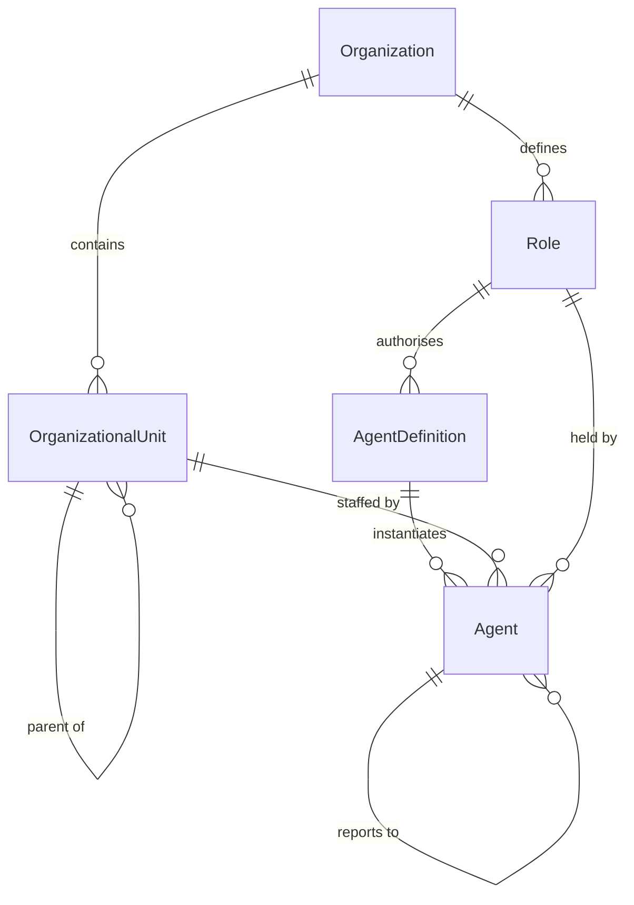
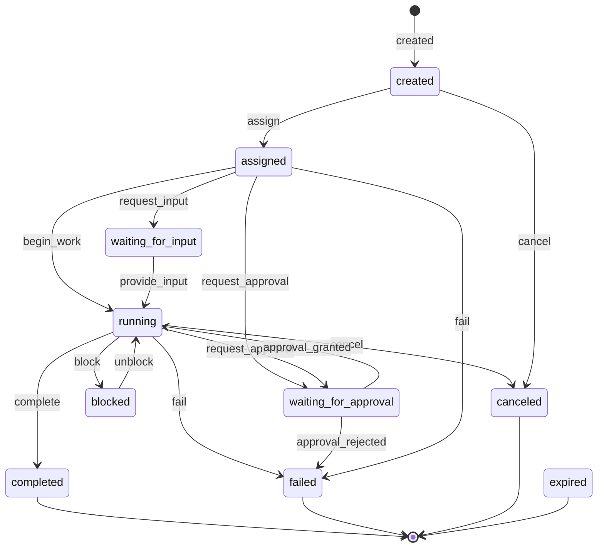
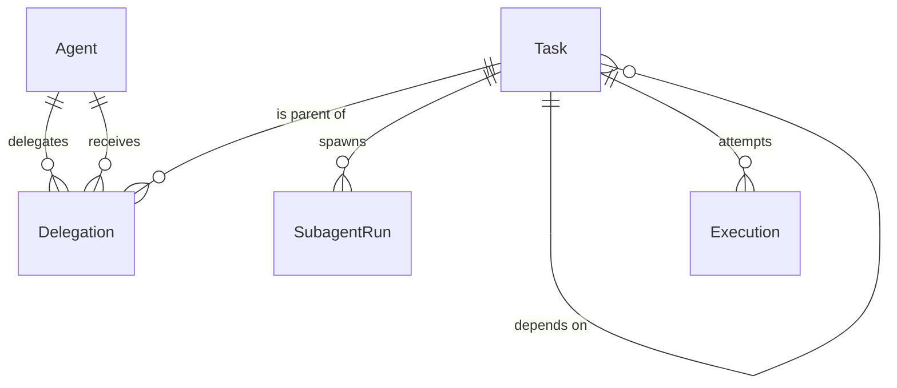
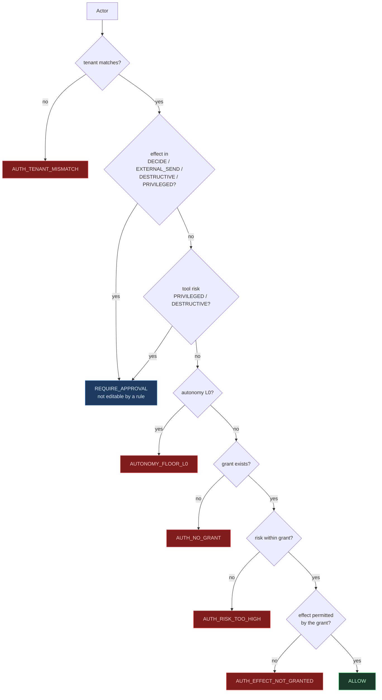
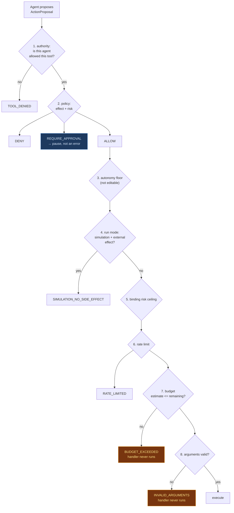
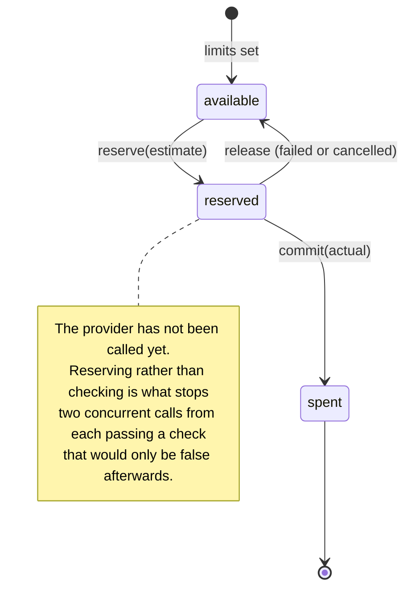
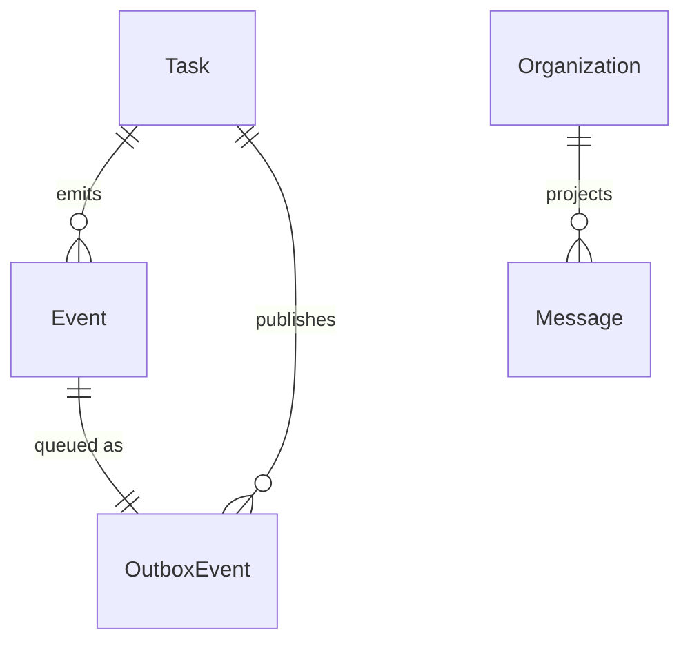

# Domain Model

## 1. The vocabulary, and why the distinctions matter

Most agent platforms collapse these. Each collapse produces a specific, observed
failure.

| Concept | Distinct from | The failure the collapse causes |
|---|---|---|
| **Organization** | Team | The isolation boundary is undefined, so RLS has nothing to key on |
| **OrganizationalUnit** | Agent | A vacant department becomes indistinguishable from a department with no director |
| **Role** | Agent | Authority is bound to an instance, so retiring the agent silently removes a capability nobody was looking at |
| **AgentDefinition** | Agent | "Which prompt was running?" has no answer for a run from six months ago |
| **Agent** | Prompt | The agent has no lifecycle, no owner, and no record of what it did |
| **SubagentRun** | Agent | A temporary worker acquires a permanent identity, and the registry fills with thousands of dead entries |
| **Skill** | Tool | A skill that *does* something is a tool with no gate |
| **Task** | Conversation | State lives in a transcript: unqueryable, undiffable, unreplayable |
| **Delegation** | Message | A handoff has no source, no route, no depth, and cannot be audited |
| **Execution** | Task | A retried task has no record of what each attempt did |
| **Blackboard entry** | Message | Coordination state is prose, so it cannot be merged or reasoned about |

## 2. Identity



An `AgentDefinition` is versioned and an `Agent` points at one version. Changing
a prompt therefore creates a new definition rather than mutating the one that
produced last quarter's result. `Agent.definition_version` stamps the run.

An `OrganizationalUnit` has a materialised `path` (`/root/front-office/sales`),
so a subtree query is one index scan rather than a recursive CTE. `OrgUnitRepository.reparent`
rewrites the path of the whole subtree and refuses a move that would place a unit
beneath its own descendant.

An agent leads a unit (`OrgUnit.head_agent_id`); a unit is not an agent. The
reference is deliberately *not* a foreign key, because the head can be
reassigned or retired while the unit persists, and the history matters.

`AgentRelationship` is a separate table for non-hierarchical edges. A real
organisation has peer routes ("ask the Risk agent") that are not parent/child;
modelling those by widening the tree would make it a graph and lose the
guarantee that a subtree query is cheap. Default-deny: no edge means no peer
delegation.

## 3. The organisation tree

```mermaid
graph TD
    CEO["CEO (human principal)"]
    ROOT["Autonomous Demo Company<br/>org unit"]
    EXEC["Executive Agent"]
    FO["Front Office"]
    MO["Middle Office"]
    BO["Back Office"]
    PMO["PMO"]
    SALES["Sales Agent"]
    MKT["Marketing Agent"]
    QA["Quality Agent"]
    RISK["Risk Agent"]
    FIN["Finance Agent"]
    IT["IT Agent"]
    PROG["Program Agent"]

    CEO -.->|submits| ROOT
    ROOT --- EXEC
    EXEC --- FO & MO & BO & PMO
    FO --- SALES & MKT
    MO --- QA & RISK
    BO --- FIN & IT
    PMO --- PROG

    style CEO fill:#1e3a5f,stroke:#60a5fa,color:#dbeafe
    style QA fill:#1a3a2a,stroke:#4ade80
    style RISK fill:#1a3a2a,stroke:#4ade80
```



Quality and Risk are `l1_low_risk_autonomous` with `max_delegation_depth: 1` and
`may_spawn_subagents: false`, while Marketing and Sales can delegate three deep.
That asymmetry is the point, and it is why the authority profiles are written out
per role rather than generated from a capability list: a generated profile gives
an auditor and an operator the same permissions by accident, and an auditor that
commissions its own evidence is not an auditor.

## 4. Task lifecycle



Three properties, each with a reason:

**Terminal states are absorbing.** `completed → running` raises a
`PreconditionError`. Re-running creates a *new* task, linked via
`task_dependencies`, because mutating the row would make the audit trail lie
about what was attempted.

**`blocked` is not `failed`.** A blocked task is waiting for something; a failed
one is broken. The distinction decides whether an operator is paged.

**Every live state can reach a terminal one.** Asserted as a test
(`test_every_live_state_can_reach_a_terminal_state`), because a state from which
nothing can fail is a deadlock by construction.

Transitions are applied with a conditional `UPDATE ... WHERE status = :expected`.
Two workers both reading `running` and both completing: the second affects zero
rows and is told so. Without the predicate the second write silently erases the
first.

## 5. Delegation



`Delegation.delegation_path` stores the full ancestor chain as JSONB. It is
persisted rather than recomputed for two reasons: the cycle check needs the route
that was actually evaluated, and an auditor needs to see it.

```json
[
  {"agent_id": "agt_01m3...", "task_id": "tsk_01m3...", "depth": 1},
  {"agent_id": "agt_01m3...", "task_id": "tsk_01m3...", "depth": 2}
]
```

A subagent deliberately has **no** `agents` row. It gets a `virtual_agent_id` and
a `subagent_runs` row, bounded on TTL, fan-out, tokens, cost and runtime. A
subagent with a permanent identity would accumulate in the registry, and the
registry is supposed to list the organisation, not its transient workers.

## 6. Authority



Three rules the shape encodes:

1. **Default deny.** No grant means no access. A role that forgets a capability
   denies it, which is the correct failure direction.
2. **Identity is data, not a claim.** `authority_profile` is attached by the
   control plane. An agent whose prompt says "you are the CEO" gets nothing,
   because the prompt is not read.
3. **Maker-checker is structural.** `require_separate_approver` compares the
   requester's id to the approver's and refuses an agent approver outright. It is
   code rather than configuration, because configuration is what an attacker with
   write access would change.

The two checks in blue sit *outside* the rule set, in `apply_autonomy_gate`. A
rule with no filters matches every action, and a catch-all "require approval"
rule shadows every allow below it — which is a bug this codebase made and fixed
during the build.

## 7. The tool gate



The order is chosen so a cheap, decisive check runs first. Every refusal happens
*before* the handler, and each is a test: `test_budget_is_refused_before_the_handler_runs`
asserts the handler was never called, not merely that an error came back.

Risk comes from the tool registry, never from the agent's
`self_assessed_risk`. A miscalibrated model must not be able to authorise itself
out of a gate.

## 8. Budget



`Decimal`, six decimal places, matching `NUMERIC(18,6)`. A pre-flight estimate
is compared to the remaining budget *before* the provider is called — refusing
afterwards is not a saving.

A child envelope can only ever be narrower than its parent's
(`clamp_to`). A subagent cannot hand itself a larger budget than the agent that
spawned it.

## 9. Memory

```mermaid
graph TD
    M["MemoryItem"] --> C1["run_context<br/>one execution"]
    M --> C2["working<br/>one task"]
    M --> C3["task_episodic<br/>one task, long"]
    M --> C4["agent"]
    M --> C5["department"]
    M --> C6["organization"]
    M --> C7["semantic<br/>cross-cutting knowledge"]
    M --> C8["audit"]

    M --> CH["MemoryChunk<br/>~1200 chars, paragraph-aware"]
    CH --> EM["embedding: vector(512)<br/>+ embedding_model"]

    style EM fill:#1a3a2a,stroke:#4ade80
```



`embedding_model` is part of the chunk's identity. Mixing vectors from two models
in one index returns nonsense with high confidence, and nothing about the query
would reveal it.

Three predicates always apply: the organization, a classification ceiling, and
ownership. An item with no owner is organisation-wide and visible to everyone in
it; an item owned by an agent is visible only to a request naming that agent.

`has_provenance` is deliberately strict: a source reference is required, and an
item written by an agent with no source does not qualify. An agent summarising
its own reasoning is not a source.

## 10. Events



The subject convention is `ao.<organization_id>.<event-type>`, so a consumer binds
to one tenant with a wildcard and never filters another tenant's traffic.

Event types are `<aggregate>.<past-tense-verb>` and the string is the wire
contract. The version travels in the envelope, not the type, because adding a
field is backward compatible and changing a field's meaning is not.

`Message` is a **projection**, written by a consumer from events. Nothing in the
platform derives business state from it, which is what keeps chat from becoming
an accidental source of truth. The projection consumer is not built; the table
and the design are, and `CURRENT_STATE.md` says so.

## 11. What the model deliberately does not have

| Not modelled | Why |
|---|---|
| A `deleted` status on anything operational | Agents are `retired`, tasks keep their row. Audit history must outlive the entity. |
| A "soft delete" on tasks, delegations or executions | The chain of custody is the product. |
| A conversation or transcript entity as canonical state | It is a projection. |
| A framework-owned agent, task or policy type | The seam is a `Protocol`. |
| A per-message or per-token cost | A call costing `$0.0004` rounded to cents reports free work as free. |
| A wildcard capability | `authority_profile.grants` is an explicit set. Absence is a denial. |
| A catch-all policy rule | A rule with no filters matches everything and shadows the allow rules. `apply_autonomy_gate` is outside the rule set for exactly this reason. |
